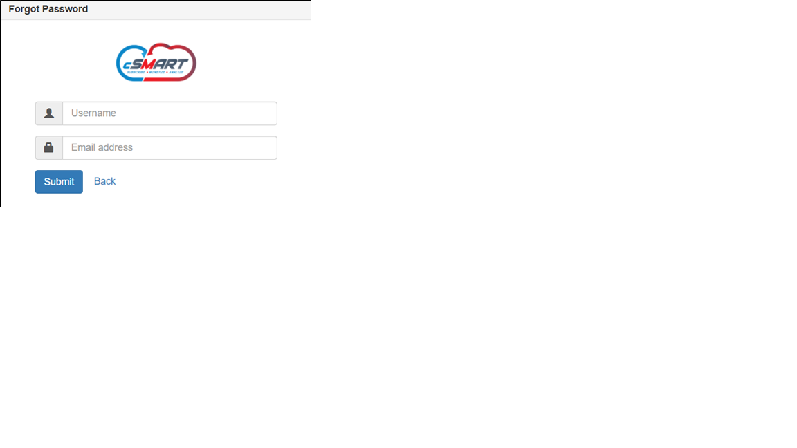
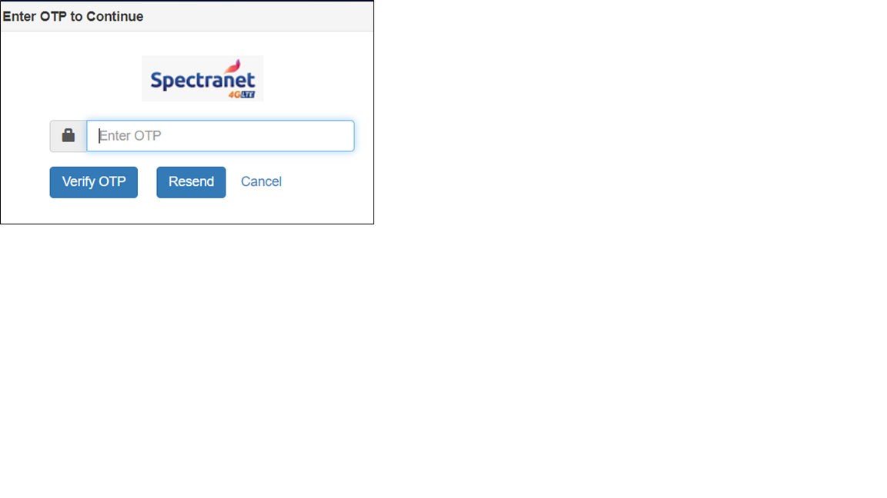



## Overview

**cSMART** is a cloud based E2E subscriber management and billing solution for enterprises, enabling monetizing the business offerings in a quick time and with no upfront investments.

**cSmart** CRM comes with a suite of simple and intuitive web-based applications for business and provides the complete lead to cash realization. Being a multi-tenanted application, it facilitates enterprises to quickly self-on-board themselves, start implementing their offerings, mange leads and opportunities, generate quotation, register customers and billing them for their services, manage taxes and perform business analytics on their offerings and revenue. It also provides a self-service portal for the end customers.

The System also provides the flexibility to the enterprise for self-configuring and customizing the solution based on their need, e.g. language, currency, UI appearance, invoice templates, payment methods, custom fields and forms etc.

Now that we have the basic idea of what the System does, let us start learning each module that the administrator uses to set up the environment for the end user.

## Log in

Once you open the **cSmart** solution in the web browser, the following screen appears:

In the above screen:
<ul>
<li>Enter the Username in the textbox.</li>
<li>Enter the Password in the textbox.</li>
<li>Click Sign in and log in.</li>
<li>Click Forgot Password to reset the password. Enter the username and Email address. Click Submit to receive the email with password reset link.</li>
</ul>

Refer to the image below:

•	If the admin enabled Two factor authorization, then after entering the user ID and password, the system will send an OTP on your mobile/email. Enter the OTP to login as shown below:

